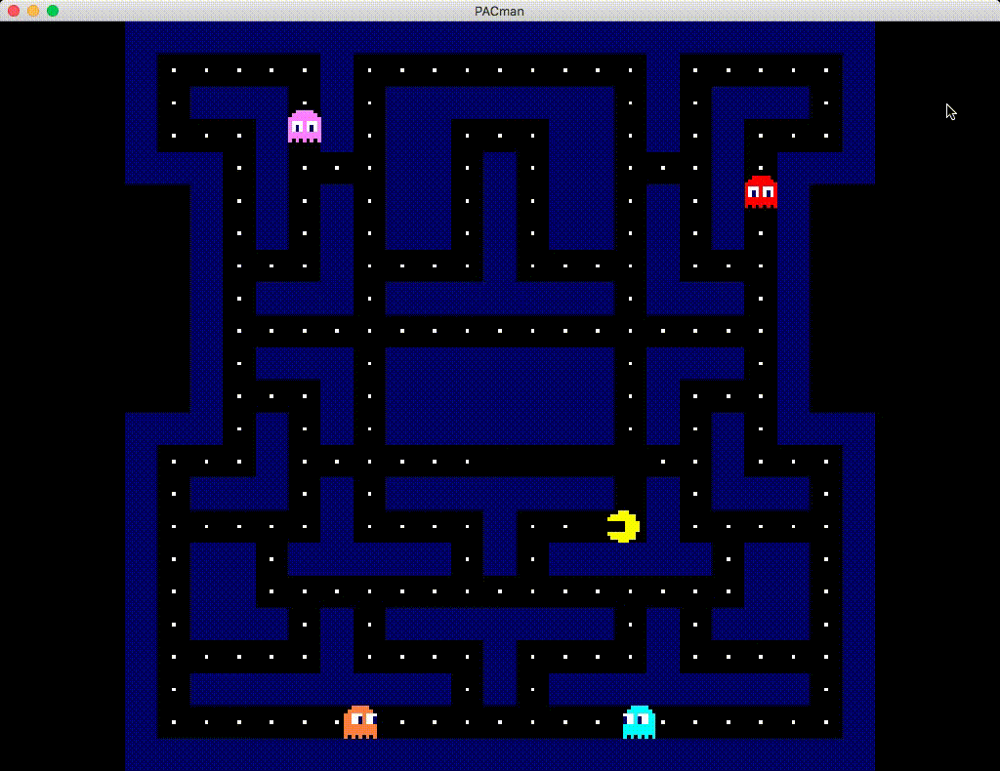

# Build:

`git clone git@github.com:mikkabouzu/pacman.git --recursive`

`cmake -B build/release -DCMAKE_BUILD_TYPE=Release`

`cmake --build build/release`

the executable will be generated to `bin/[your_platform]_release`

# Controls:
  * `esc`/`q` : quit
  * `p` : pause / resume / restart
  * `wasd`/`arrow keys` : control player

